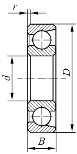

Программа для рассчета долговечности подшипника для курсовой по предмету
                    Информационные системы и технологии.
                            Вариант работы №2. 
Подшипник радиально-упорный шариковый однорядный легкой серии №36204 (ГОСТ 831-75)

Программа реализована на Python с использованием его стандартной библиотеки 

Теоритическая часть по подшипникам:
Зависимость между номинальной долговечностью (расчётным сроком службы), динамической грузоподъёмностью и
действующей на подшипник нагрузкой определяется формулой

                            L = (C / P) ^ p

где:        
L- номинальная долговечность, млн.оборотов;
C- динамическая грузоподъёмность;
P – эквивалентная динамическая нагрузка;
p – показатель степени в формуле долговечности
                (для шариковых подшипников p=3, для роликовых p= 10/3 или 3,33).

Эквивалентной динамической нагрузкой для радиальных шариковых и радиально – упорных подшипников называется
постоянная радиальная нагрузка, которая при приложении её к подшипнику с вращающимся внутренним кольцом и
неподвижным наружным обеспечивает такой же расчётный срок службы, как при действительных условиях нагружения
и вращения. Для этих типов подшипников эквивалентная динамическая нагрузка определяется по формуле:

                            P = (X * V * Fr + Y * Fa) * Кб * КT

где:  
Fr – постоянная по величине и направлению радиальная нагрузка, Н;
Fa- постоянная по величине и направлению осевая нагрузка, Н;
X - коэффициент радиальной нагрузки;
Y - коэффициент осевой нагрузки;
V – коэффициент вращения (V=1);
Кб – коэффициент безопасности;
КT – температурный коэффициент.

Эквивалентная динамическая нагрузка для подшипников, не обладающих осевой или
радиальной нагрузкой может быть определена по формулам:

                            P = X * V * Fr * Кб * КT
                            P = Y * Fa * Кб * КT
