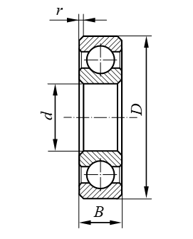
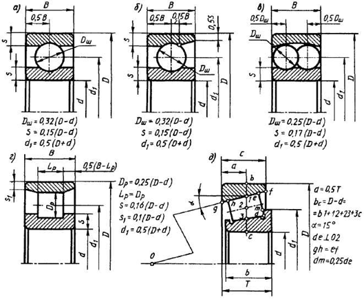

Программа для рассчета долговечности подшипника для курсовой по предмету
                    Информационные системы и технологии.
                            Вариант работы №2. 
Подшипник радиально-упорный шариковый однорядный легкой серии №36204 (ГОСТ 831-75)

Программа реализована на Python с использованием его стандартной библиотеки 

Теоритическая часть по подшипникам:

Расчёт подшипников на долговечность производится исходя из их динамической грузоподъёмности.

Динамической грузоподъёмностью радиальных и радиально-упорных подшипников называется постоянная радиальная нагрузка, 
которую группа идентичных  подшипников с неподвижным наружным кольцом сможет выдержать в течение расчетного срока 
службы, исчисляемого в часах.

Долговечность подшипника определяется как срок службы до появления признаков контактной усталости металла на любом 
из колец или тел качения.

Под расчётным сроком службы понимают срок службы партии подшипников, в которых не менее 90% одинаковых подшипников, 
при одной и той же нагрузке и частоте вращения должны обработать без появления  на рабочих поверхностях раковин и 
отслаивания.

Зависимость между номинальной долговечностью (расчётным сроком службы), динамической грузоподъёмностью и
действующей на подшипник нагрузкой определяется формулой

                            L = (C / P) ^ p

где:        
L- номинальная долговечность, млн.оборотов;
C- динамическая грузоподъёмность;
P – эквивалентная динамическая нагрузка;
p – показатель степени в формуле долговечности
                (для шариковых подшипников p=3, для роликовых p= 10/3 или 3,33).

Эквивалентной динамической нагрузкой для радиальных шариковых и радиально – упорных подшипников называется
постоянная радиальная нагрузка, которая при приложении её к подшипнику с вращающимся внутренним кольцом и
неподвижным наружным обеспечивает такой же расчётный срок службы, как при действительных условиях нагружения
и вращения. Для этих типов подшипников эквивалентная динамическая нагрузка определяется по формуле:

                            P = (X * V * Fr + Y * Fa) * Кб * КT

где:  
Fr – постоянная по величине и направлению радиальная нагрузка, Н;
Fa- постоянная по величине и направлению осевая нагрузка, Н;
X - коэффициент радиальной нагрузки;
Y - коэффициент осевой нагрузки;
V – коэффициент вращения (V=1);
Кб – коэффициент безопасности;
КT – температурный коэффициент.

Эквивалентная динамическая нагрузка для подшипников, не обладающих осевой или
радиальной нагрузкой может быть определена по формулам:

                            P = X * V * Fr * Кб * КT
                            P = Y * Fa * Кб * КT

Обозначение нормальных габаритных размеров подшипников качения:

Изображение подшипников качения в разрезе:
а) подшипник шариковый радиальный;
б) подшипник шариковый радиально-упорный;
в) подшипник шариковый двухрядный сферический;
г) подшипник роликовый радиальный;
д) подшипник роликовый радиально-упорный.

d – диаметр отверстия внутреннего кольца радиального и радиально-упорного подшипника и «тугого» кольца одинарного упорного подшипника;
d1– диаметр отверстия свободного кольца упорного подшипника;
D – внешний диаметр наружного кольца  радиального и радиально-упорного подшипника и свободного кольца упорного подшипника;
B – ширина колец  радиальных и радиально-упорных подшипников или ширина внутреннего кольца, если ширины колец не одинаковы;
T – монтажная высота роликового радиально-упорного конического подшипника;
H- высота упорного подшипника.
Размеры тел качения для основных типов подшипников можно определить по следующим формулам:
dТ = 0,3*(D - d) для радиальных и радиально-упорных шарикоподшипников;
dТ = 0,25*(D - d); 
l = (1,5+1,7)*dТ  для серий лёгкой, широкой и средней широкой и l = dТ у всех остальных серий радиальных подшипников с короткими цилиндрическими роликами,
где dТ  - диаметр тела качения (шарика или ролика);
      l – длина ролика.
Для шарикоподшипников:
S – толщина кольца S = 0,15*(D - d),
d1 – ось шарика d1 = 0,5*(D + d).